# This project implements a complete DevOps lifecycle using CI/CD pipeline with Jenkins, Docker, Ansible, and AWS.

## 📊 DevOps Lifecycle Diagram

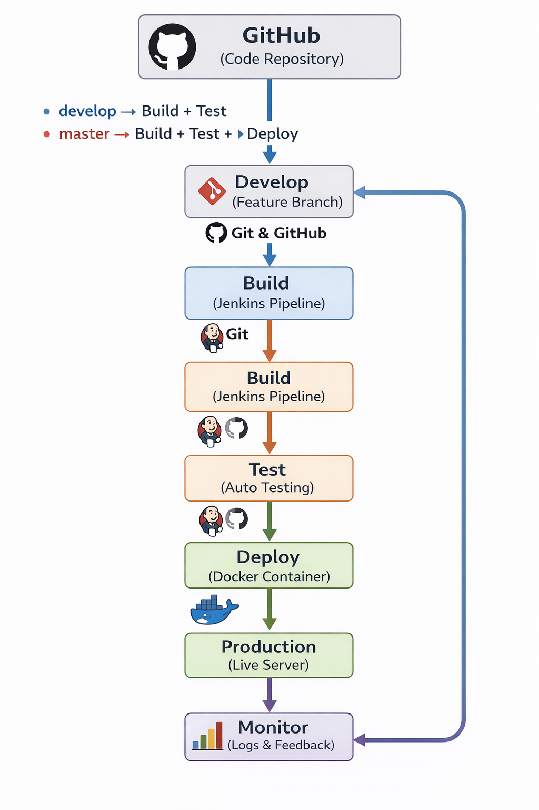

## Explanation

This project demonstrates the DevOps lifecycle:

* Code is stored and managed using GitHub
* When code is pushed to **develop branch**, Jenkins triggers build and testing
* When code is pushed to **master branch**, Jenkins performs build, testing, and deployment
* Docker is used to containerize the application
* Ansible is used for configuration management and setup
* The application is deployed on AWS for production use
* After deployment, the system is monitored for performance and improvements

This process repeats continuously, forming the DevOps lifecycle.

## 🔧 Tools Used

* Git & GitHub
* Jenkins
* Docker
* Ansible
* AWS

## 📸 Project Screenshots

### 🖥️ EC2 Instance Running

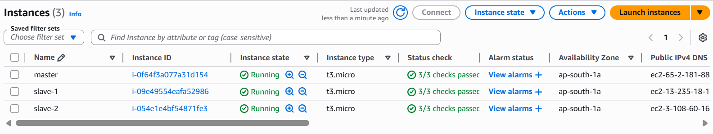

### 🔗 Master Node Connection

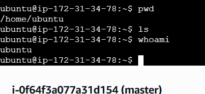

### 🔗 Slave Node 1 Connection

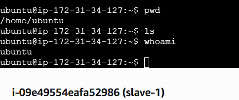

### 🔗 Slave Node 2 Connection

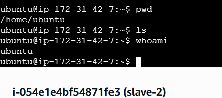

## ⚙️ Configuration Script

The required software is installed using a shell script.

Script file: [a.sh](a.sh)

## ⚙️ Configuration Setup

Ansible was installed on the master machine using a shell script and verified using the version command.

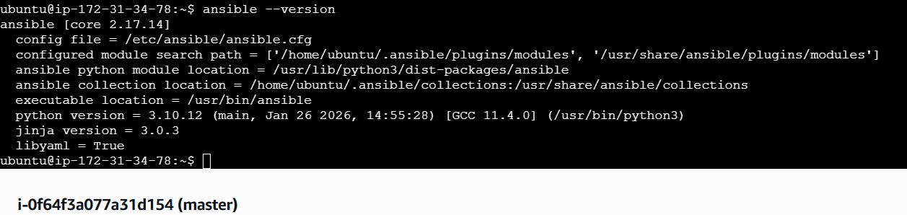

### ⚙️ Ansible Connectivity Check

The connectivity between master and slave nodes is verified using Ansible ping module.

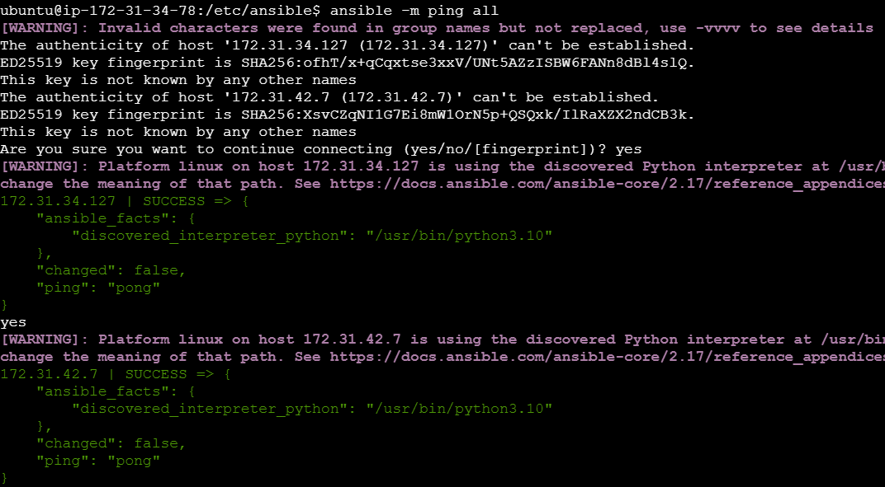

## ⚙️ Ansible Playbook for Automation

An Ansible playbook is used to automate the installation of Java and Jenkins on the master node and Docker on the slave nodes.

Playbook file: [play.yaml](play.yaml)

### ▶️ Playbook Execution and Verification

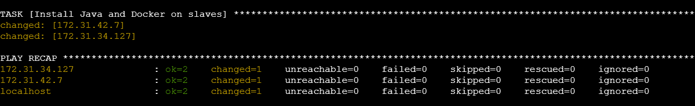

### 🐳 Docker and Java Installation on Slave machines

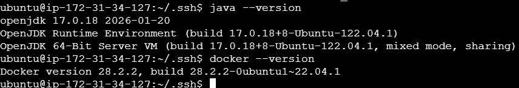

## 🚀 Jenkins Setup and CI/CD Pipeline

Jenkins is installed and configured on the master node and accessed using the public IP address on port 8080.

It is used to automate the build, test, and deployment process in the DevOps lifecycle.

### 🏠 Jenkins Dashboard
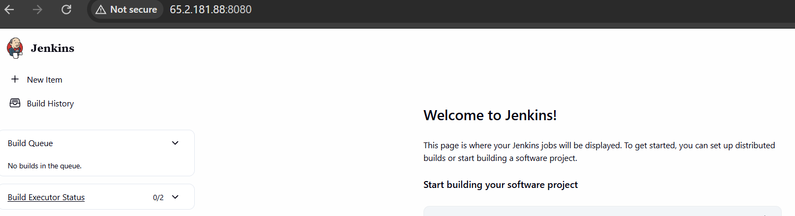

## 🖥️ Jenkins Distributed Nodes Setup

Jenkins is configured with multiple nodes (agents) to simulate different environments.

- Test Node: Used for testing builds (slave1)
- Production Node: Used for deployment (slave2)

These nodes are connected via SSH and managed from the Jenkins master, allowing jobs to run on specific environments using labels.

### 🚀 Production Node Configuration
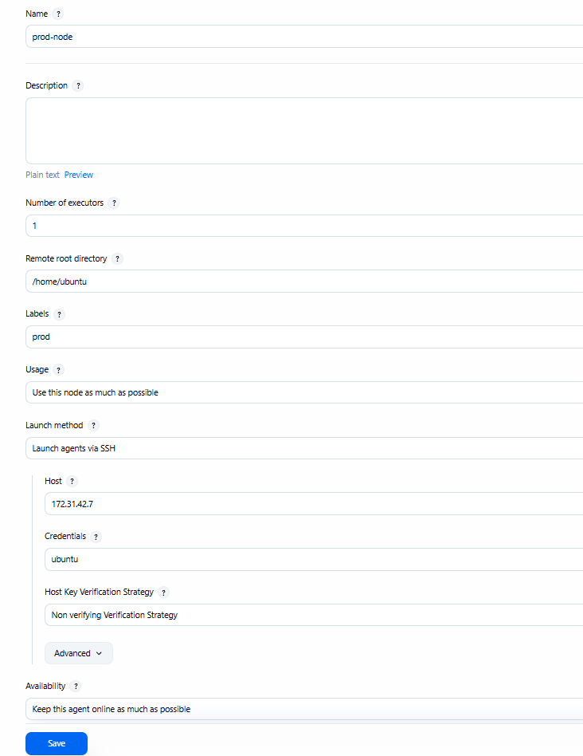

### 🔗 Connected Nodes
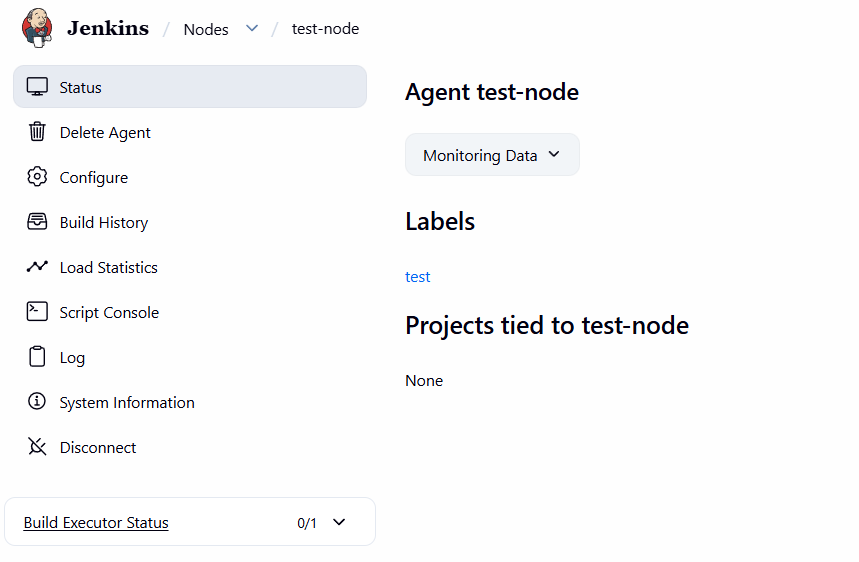

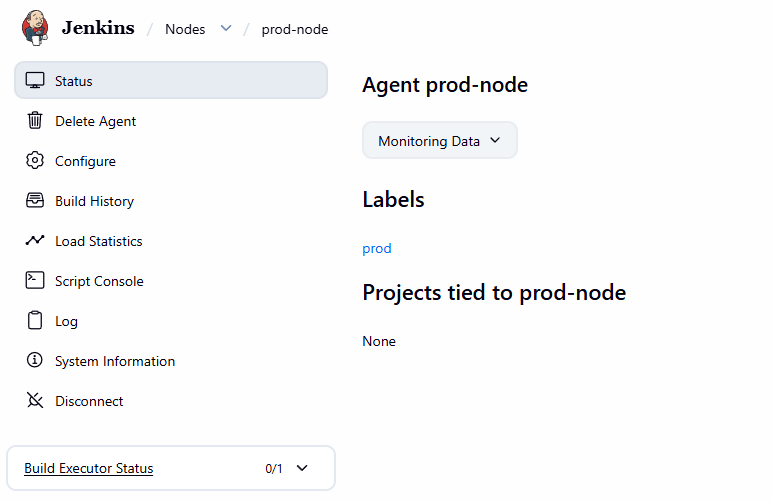

### ⚙️ Pipeline Configuration
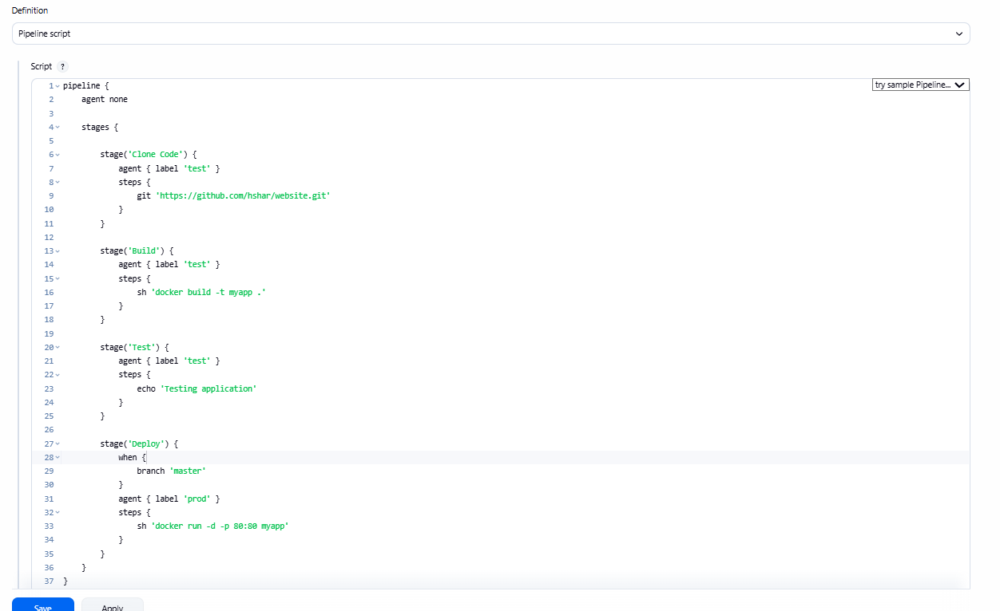

### 🔄 GitHub Webhook Integration

Jenkins is configured to automatically trigger the pipeline when code is pushed to GitHub using webhook integration.

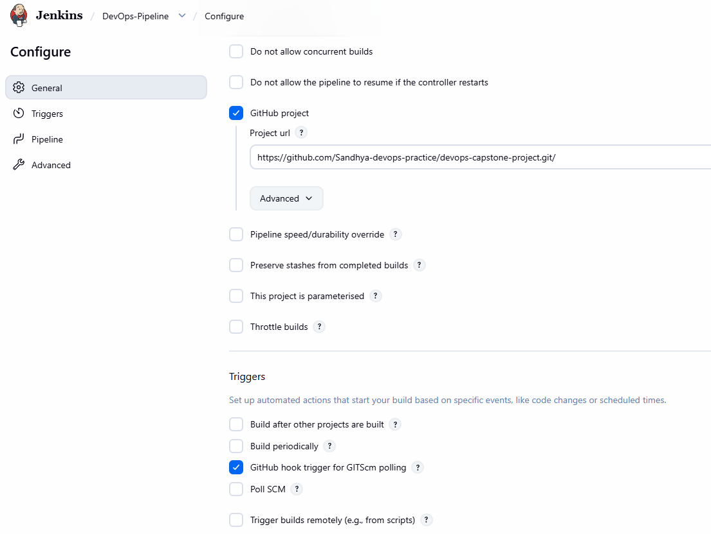

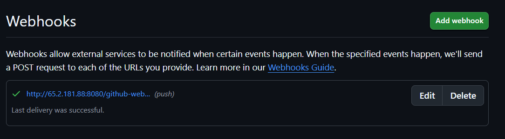

### 🐳 Docker Configuration

A Dockerfile is used to containerize the application using Nginx.

### ▶️ Pipeline Execution
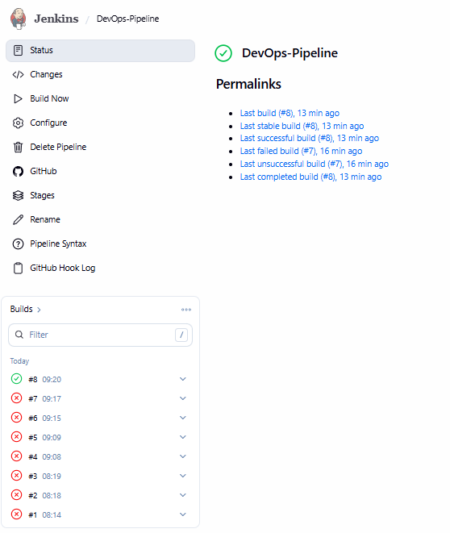

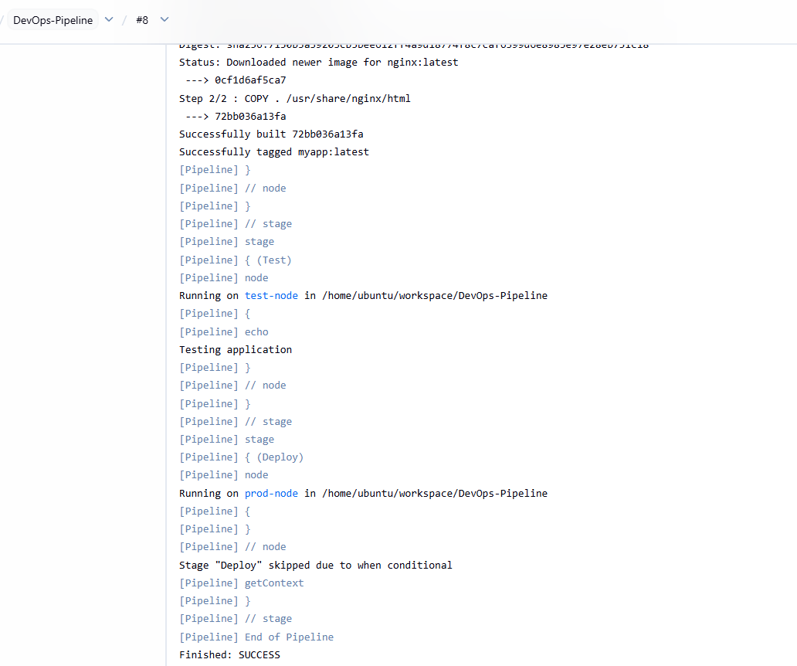

## ✅ Conclusion
This project successfully demonstrates automation of build, test, and deployment using DevOps tools and practices.

