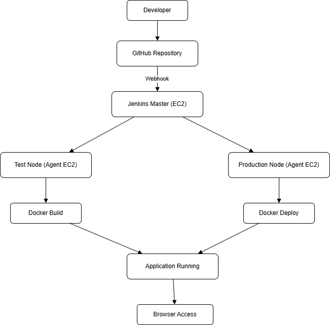
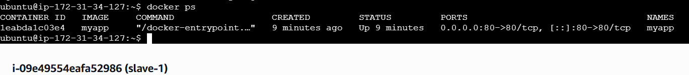
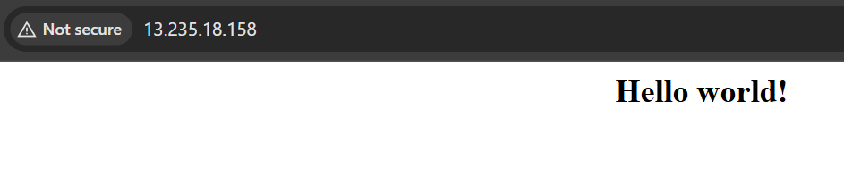

# In this project, I focused on building a complete CI/CD pipeline from scratch using Jenkins, Docker, and Ansible on AWS.

The goal was to simulate a real-world environment by separating development and production workflows and automating the entire deployment process.

## ⚠️ Challenges Faced

- Jenkins pipeline was not triggering via webhook → Resolved by correcting GitHub webhook URL and enabling trigger option in Jenkins

- Docker container was not accessible in browser → Opened port 80 in AWS Security Group

- In my jenkins pipeline setup, I initially faced multiple build failures (around 5 - 7 builds)

- The failures were mainly due to configuration issues rather than code problems

   First, I had an incorrect Git repository URL, which caused the clone stage to fail.

   After applying these fixes and restarting the instance, the pipeline executed successfully.

   The jenkins pipeline was running on a slave node using ubuntu user, which did not have access to the docker daemon, I resolved it by adding the user to the docker          group and restarting the instance so the permission could take effect.

- This experience helped me understand Jenkins agent behavior, Linux permissions and docker integration in CI/CD pipelines and also these failures helped me in
  understanding the interaction between jenkins agent with docker and linux permission.

- Pipeline script and Dockerfile → Initially, I worked on pipeline scripts, and to better understand the concepts, I also built the application using a Dockerfile.

  ##🚀Key Features

- Automated CI/CD using Jenkins
- Multi-node (master-agent) architecture
- Docker-based deployment
- Ansible for configuration management
- GitHub webhook integration
- Branch-based pipeline execution

## 📊 CI/CD architecture Diagram

## 🏗️ Architecture Overview

- Jenkins Master handles pipeline orchestration
- Slave 1 (Test Node) runs testing stages
- Slave 2 (Production Node) handles deployment
- Docker containers are used to run the application
- AWS EC2 instances host all components

## 🔍 Workflow Explanation

In this project, I set up a CI/CD workflow where:

- Code is pushed to GitHub and triggers Jenkins via webhook
- For the develop branch, Jenkins runs build and testing stages
- For the master branch, Jenkins executes the full pipeline including deployment
- Docker is used to containerize the application before deployment
- Ansible automates the setup and configuration across multiple nodes
- The application is deployed on AWS EC2 instances and verified through browser access

In this project it helped me understand how automated pipelines work in real-world DevOps environments.

## 🔧 Tools Used

* Git & GitHub
* Jenkins
* Docker
* Ansible
* AWS

## 🔐 Ports & Security Group Configuration

The following ports were configured in AWS Security Groups to allow proper communication between components:

- SSH (22) → Used to connect to EC2 instances
- HTTP (80) → Used to access the application in the browser
- Jenkins (8080) → Used to access Jenkins dashboard

These configurations ensured secure and controlled access to the infrastructure.

## 📸 Project Screenshots

### 🖥️ EC2 Instance Running

### 🔗 Master Node Connection

### 🔗 Slave Node 1 Connection

### 🔗 Slave Node 2 Connection

## ⚙️ Configuration Script

The required software is installed using a shell script.

Script file: [a.sh](a.sh)

## ⚙️ Configuration Setup

Ansible was installed on the master machine using a shell script and verified using the version command.

### ⚙️ Ansible Connectivity Check

The connectivity between master and slave nodes is verified using Ansible ping module.

## ⚙️ Ansible Playbook for Automation

An Ansible playbook is used to automate the installation of Java and Jenkins on the master node and Docker on the slave nodes.

Playbook file: [play.yaml](play.yaml)

### ▶️ Playbook Execution and Verification

### 🐳 Docker and Java Installation on Slave machines

## 🚀 Jenkins Setup and CI/CD Pipeline

Jenkins is installed and configured on the master node and accessed using the public IP address on port 8080.

It is used to automate the build, test, and deployment process in the DevOps lifecycle.

### 🏠 Jenkins Dashboard

## 🖥️ Jenkins Distributed Nodes Setup

Jenkins is configured with multiple nodes (agents) to simulate different environments.

- Test Node: Used for testing builds (slave1)
- Production Node: Used for deployment (slave2)

These nodes are connected via SSH and managed from the Jenkins master, allowing jobs to run on specific environments using labels.

### 🚀 Production Node Configuration

### 🔗 Connected Nodes

### ⚙️ Pipeline Configuration

## 📄 Jenkins Pipeline Script

Jenkinsfile defines the CI/CD stages including:
- Code checkout
- Build
- Test
- Docker build
- Deployment

### 🔄 GitHub Webhook Integration

Jenkins is configured to automatically trigger the pipeline when code is pushed to GitHub using webhook integration.

### 🐳 Docker Configuration

A Dockerfile is used to containerize the application using Nginx.

### ▶️ Pipeline Execution

## Project Output

### Docker Container Running

### Application Output in Browser

## ✅ Conclusion

This project provided practical exposure to building and troubleshooting CI/CD pipelines in a distributed environment. It strengthened my understanding of Jenkins agents, Docker integration, and infrastructure automation using Ansible on AWS.
